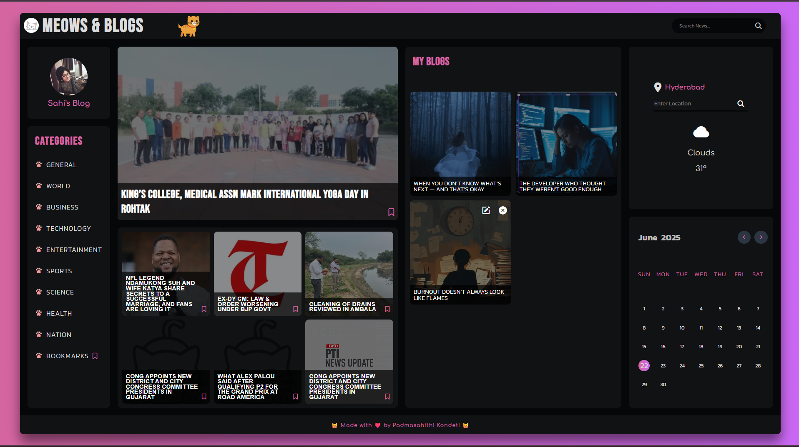
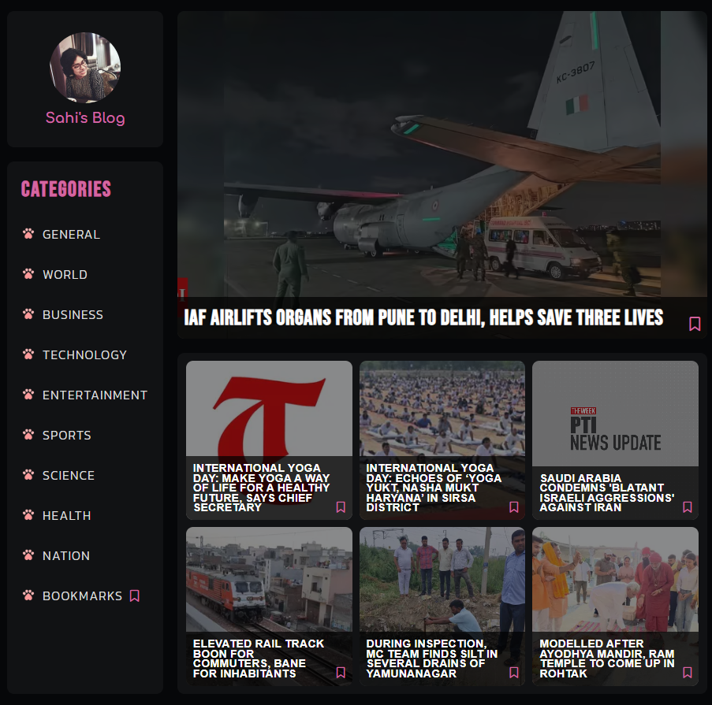
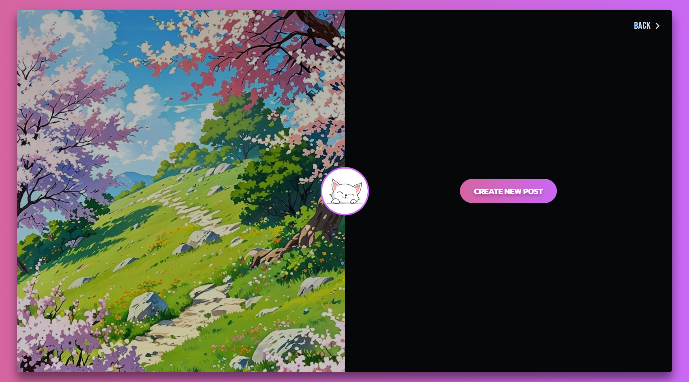

# Meows & Blogs 🐾📝

A playful and interactive **Cat-Themed News & Blogging Web App** built with **React.js**, offering real-time news browsing, bookmarking, and a personal blogging space — all with a fun feline touch! 😸

---

## 🚀 Features

- 📰 **News Section**
  - Fetches latest news articles using APIs.
  - Categorized news options (General, World, Business, Technology, Entertainment, Sports, Science, Health, Nation).
  - Bookmark your favorite articles for later reading.

- 📝 **Blogging Section**
  - Create, edit, and delete personal blog posts.
  - Supports image uploads for blogs.
  - Blogs stored in **LocalStorage** for data persistence across browser sessions.

- 🌟 **Interactive UI**
  - Cat-themed, visually appealing, and playful design.
  - Smooth navigation between News and Blogs sections.
  - **Fully responsive** for Desktop, Tablet, and Mobile devices.

---

## 🛠️ Technologies Used

- **React.js** (with Vite)
- **JavaScript (ES6+)**
- **CSS3**
- **Axios** (for fetching news)
- **LocalStorage** (for blog storage)

---

## 💻 Getting Started

### Prerequisites
- Node.js (v14 or later)
- npm or yarn

### Installation Steps

1. **Clone the Repository:**

```bash
git clone https://github.com/your-username/meows-and-blogs.git
cd meows-and-blogs
```

2. **Install Dependencies:**

```bash
npm install
```

3. **Start Development Server:**

```bash
npm run dev
```

4. Open in browser:

```
http://localhost:5173
```

---

## 📁 Project Structure

```
/src
│
├── App.jsx            # Main App Component
├── index.css         # Global Styles
├── main.jsx          # React Entry Point
│
├── /Components
│   ├── News.jsx      # News Section Component
│   ├── Blogs.jsx     # Blog Section Component
│   ├── News.css      # Styles for News
│   └── Blogs.css     # Styles for Blogs
│
└── /assets/images    # Cat-themed images and icons
```

---

## 🌐 Deployment (Optional)

For deployment on platforms like **Vercel** or **Netlify**:

1. **Build the App:**

```bash
npm run build
```

2. Upload the contents of the `dist/` folder to your hosting service.

---

## 📦 Future Enhancements

- 🔗 Backend Integration (Node.js/Express or FastAPI)
- 🔐 User Authentication & Login System
- 💬 Commenting System for Blogs
- 🌗 Light/Dark Theme Toggle
- 🖼️ Blog Image Gallery Feature

---

## 📸 Screenshots 

### 🏠 Home Page


### 📰 News Section


### 📝 Blog Section


---

## 🙌 Acknowledgements

- **News API** — for providing real-time news articles.
- **React.js & Vite** — for smooth SPA development.
- **Open-source cat graphics/icons** — for the cute theme. 🐱

---

## 📝 License

This project is licensed under the **MIT License**. See the [LICENSE](LICENSE) file for details.

---

## 🤝 Connect with Me

- **GitHub**: https://github.com/MeeshuNini
- **LinkedIn**: https://www.linkedin.com/in/padmasahithikondeti/
